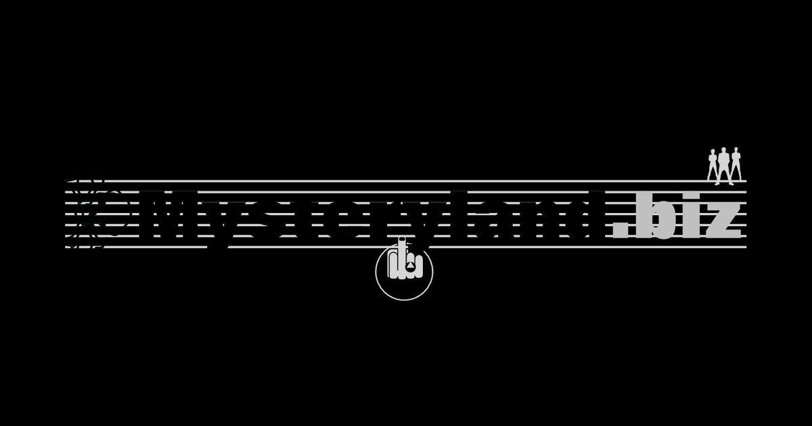

# Mysteryland

[](https://github.com/wearesolutionarchitects/mysteryland/actions/workflows/ci.yml)
[](https://mysteryland.biz)
[](./LICENSE)



Mysteryland ist ein öffentliches, quellenbasiertes Konzertarchiv mit persönlichen Erinnerungen seit 1979. Die Website verbindet strukturierte Eventdaten, Künstlerprofile, Tickets, Fotos, Setlists und Alben zu einer langfristig wartbaren digitalen Chronik.

Das Repository dokumentiert nicht nur das Ergebnis auf [mysteryland.biz](https://mysteryland.biz), sondern auch den technischen und redaktionellen Prozess dahinter: von den Metadaten in Apple Fotos über reproduzierbare Import- und Medienabläufe bis zur geprüften Veröffentlichung mit Astro und GitHub Actions.

## Was dieses Projekt auszeichnet

- **Strukturierte Inhalte:** Events und Künstler werden als typisierte MDX-Content-Collections gepflegt.
- **Nachvollziehbare Herkunft:** Foto- und Eventmetadaten werden aus einer definierten Quelle übernommen; unbekannte Angaben bleiben ausdrücklich `TBA`, statt geraten zu werden.
- **Konsistente Darstellung:** Ein zentraler Renderer erzeugt ein einheitliches Event-Gerüst mit Fakten, Galerie, Videos, Setlists, Alben und SEO-Daten.
- **Technisches SEO:** Canonical URLs, Open Graph, Twitter Cards, Sitemap und statusabhängige Event-JSON-LD-Daten werden zentral erzeugt.
- **Nachvollziehbarer Intake:** Genau ein strukturiertes GitHub Issue bildet den kanonischen Startpunkt für jedes Event und seine MDX-Datei.
- **Reproduzierbare Workflows:** Einzelne, kombinierbare Node.js-Skripte automatisieren Medienimport, Galeriepflege, OG-Bilder, Setlists, Alben und Social-Media-Entwürfe.
- **Qualität vor Deployment:** Astro-, TypeScript-, Test- und Build-Prüfungen laufen lokal und in der CI, bevor die Website veröffentlicht wird.

## Technischer Überblick

| Bereich | Umsetzung |
| --- | --- |
| Framework | Astro 7 mit Starlight und Preact |
| Inhalte | MDX Content Collections mit Schema-Validierung |
| Medien | Sharp, EXIF-Metadaten und lokale Bildbestände |
| SEO | Zentrale Metadaten, Event JSON-LD, Sitemap und Open Graph |
| Automatisierung | Node.js-ESM-Skripte und GitHub Actions |
| Qualität | Astro Check, TypeScript, Node Test Runner und Produktions-Build |
| Betrieb | Verifiziertes SSH-Release-Deployment nach `main` |

## Lokaler Einstieg

Vorausgesetzt werden Node.js 26 oder neuer und npm 11 oder neuer. Für den Foto-Workflow wird zusätzlich `exiftool` benötigt.

```bash
git clone https://github.com/wearesolutionarchitects/mysteryland.git
cd mysteryland
npm ci
npm run dev
```

Der Entwicklungsserver ist anschließend standardmäßig unter `http://localhost:4321` erreichbar.

## Alle npm-Kommandos

Die folgende Übersicht umfasst alle Skripte aus [`package.json`](./package.json). Alle Kommandos werden im Repository-Hauptverzeichnis ausgeführt. `npm run` zeigt die aktuell verfügbaren Skripte; Argumente werden nach `--` übergeben.

### Entwicklung und Qualität

| Kommando | Zweck |
| --- | --- |
| `npm run dev` | Lokalen Entwicklungsserver starten |
| `npm run build` | Produktionsversion nach `dist/` bauen |
| `npm run preview` | Den Produktions-Build lokal anzeigen |
| `npm run astro -- --help` | Astro-CLI und ihre Optionen anzeigen |
| `npm run check` | Astro-Komponenten und Content-Schemas prüfen |
| `npm run typecheck:ts` | TypeScript ohne Dateiausgabe prüfen |
| `npm run test` | Alle vorhandenen Node-Tests ausführen |
| `npm run test:seo` | SEO-Tests ausführen |
| `npm run verify` | Astro, TypeScript, Tests und Produktions-Build nacheinander prüfen |
| `npm run postinstall` | Dependency-Patches anwenden; läuft auch automatisch nach der Installation |

### Events, Bilder und Künstler

`YYYY-MM-DD` steht für das Eventdatum, `ASIN` für die Amazon-Albumkennung.

| Kommando | Zweck |
| --- | --- |
| `npm run event` | Interaktiven Assistenten für den vollständigen Event-Workflow starten |
| `npm run event:media` | Neue Bilder aus `src/content/gallery/inbox/` in die datierten Galerieordner importieren |
| `npm run event:gallery -- YYYY-MM-DD` | Bilder in die Galerie einer bestehenden Event-MDX übernehmen; Vorschau mit `--dry-run` |
| `npm run event:og -- YYYY-MM-DD` | Open-Graph-Bild für ein Event erzeugen |
| `npm run event:seo` | Event-SEO-Metadaten prüfen; Änderungen mit `npm run event:seo -- --write` anwenden |
| `npm run event:setlist -- YYYY-MM-DD` | Setlist ergänzen; eine konkrete Quelle kann mit `--url URL` angegeben werden |
| `npm run event:album -- YYYY-MM-DD ASIN` | Album einschließlich lokalem Cover ergänzen |
| `npm run event:covers` | Vorhandene externe Amazon-Cover lokalisieren und die Verweise aktualisieren |
| `npm run event:outbox -- YYYY-MM-DD` | Event-Outbox für die weitere Verarbeitung vorbereiten |
| `npm run event:social -- YYYY-MM-DD` | Plattformspezifische Social-Media-Texte und Bilder erzeugen |
| `npm run artist:sync` | Künstlerprofile und Statistiken synchronisieren |

### Betrieb und GitHub

| Kommando | Zweck |
| --- | --- |
| `npm run deploy:ssh` | SSH-Release-Deployment mit konfiguriertem Ziel und Zugang ausführen |
| `npm run script:github:create-labels` | Kanonische GitHub-Labels synchronisieren |

Die granularen `event:*`-Kommandos bleiben bewusst erhalten. Sie können direkt, aus dem Assistenten oder später aus weiteren Automationen aufgerufen werden.

## Event-Workflow

Apple Fotos ist die fachliche Quelle für Bildtitel, Beschreibungen und Schlagwörter. Exportierte Dateien werden lokal verarbeitet; die Skripte verändern jeweils nur ihren klar abgegrenzten Bereich.

```text
Event-Issue ──► Event-MDX ─────────────────────┐
                                              │
Apple Fotos ──► Galerie-Inbox ──► Medienimport ┤
                                              │
                                              ├─► Galerie synchronisieren
                                              ├─► Open-Graph-Bild erzeugen
                                              ├─► Setlists und Alben ergänzen
                                              ├─► Social-Entwürfe vorbereiten
                                              └─► prüfen, bauen, veröffentlichen
```

Ein neues Event beginnt im strukturierten [Event-Issue-Formular](https://github.com/wearesolutionarchitects/mysteryland/issues/new?template=02-neues-event.yml). Dabei gilt verbindlich: ein Issue entspricht genau einem Event. Nach Anlage der Event-MDX unterstützt der lokale Assistent die nachgelagerten Medien- und Veröffentlichungsschritte:

```bash
npm run event
```

Der Assistent fragt notwendige Parameter ab, validiert Eingaben und zeigt das konkrete npm-Kommando vor der Ausführung. Schreibende Optionen wie `--write` müssen ausdrücklich bestätigt werden.

Eine vollständige Beschreibung der einzelnen Schritte und der erwarteten Event-Metadaten steht in der [Workflow-Dokumentation](./docs/01-scripts/README.md).

### Neue Bilder aus der Inbox importieren

Exportierte JPG/JPEG-, PNG- oder WebP-Dateien werden in [`src/content/gallery/inbox/`](./src/content/gallery/inbox/) abgelegt. Für den Import muss `exiftool` verfügbar sein. Anschließend im Repository-Hauptverzeichnis ausführen:

```bash
npm run event:media
```

Das Kommando verarbeitet die gesamte Inbox und **verschiebt** die Bilder nach `src/content/gallery/YYYY/MM/DD/`. Datum und Uhrzeit stammen bevorzugt aus einem passenden Dateinamen, danach aus den EXIF-Erstellungsdaten und ersatzweise aus dem Bildtitel. Die Zieldateien heißen `YYYY-MM-DD_HH-MM-SS.ext`; `.jpeg` wird zu `.jpg` normalisiert. Vorhandene Zieldateien werden nicht überschrieben. Dateien ohne ermittelbares Datum oder mit Zielkonflikten bleiben in der Inbox; der Lauf meldet dann einen Fehler, auch wenn andere Bilder bereits importiert wurden.

Damit die importierten Bilder auf einer bestehenden Eventseite erscheinen, anschließend deren Galerie synchronisieren. Beispiel für OMD am 1. September 2026:

```bash
npm run event:gallery -- 2026-09-01 --dry-run
npm run event:gallery -- 2026-09-01
npm run verify
```

Die Galerie-Synchronisation ergänzt Bild-Imports und den `<Gallery>`-Block der Event-MDX. Danach die neuen Bildbeschreibungen prüfen und die Seite mit `npm run dev` ansehen. Weitere Details stehen unter [Bilder importieren](./docs/01-scripts/README.md#1-bilder-importieren).

## Repository-Struktur

```text
.
├── .github/                 # CI, Deployment, Issue- und PR-Vorlagen
├── docs/                    # Prozess- und Automatisierungsdokumentation
├── public/                  # Statische und abgeleitete öffentliche Assets
├── scripts/deploy/          # Deployment-Werkzeuge
├── src/components/          # Wiederverwendbare Astro-Komponenten
├── src/content/docs/events/ # Kanonische Event-MDX-Dateien
├── src/content/docs/artists/# Generierte und gepflegte Künstlerprofile
├── src/content/gallery/     # Lokaler, ereignisbezogener Bildbestand
└── src/scripts/             # Event-, Artist- und GitHub-Automationen
```

## Qualität und Veröffentlichung

`npm run verify` ist das gemeinsame Qualitäts-Gate für lokale Entwicklung, Pull Requests und Deployments. Es umfasst:

1. Astro- und Content-Schema-Prüfung,
2. TypeScript-Typprüfung,
3. automatisierte Tests,
4. vollständigen Produktions-Build.

Pull Requests verwenden dieselbe Prüfung in GitHub Actions. Änderungen an `main` werden erst nach erfolgreichem Verify-Schritt als Release auf [mysteryland.biz](https://mysteryland.biz) ausgerollt.

## Planung und Beiträge

Arbeit wird über strukturierte GitHub Issues, präfixierte Steuerungslabels und Pull Requests nachvollziehbar gemacht. Die kanonische Labeldefinition liegt im Repository und kann idempotent synchronisiert werden. Das vorgesehene Zusammenspiel von Labels, GitHub Projects und künftigen Actions ist in der [GitHub-Planungsdokumentation](./docs/01-scripts/github-planning.md) beschrieben.

Fehlerberichte und konkrete Verbesserungsvorschläge sind als [GitHub Issue](https://github.com/wearesolutionarchitects/mysteryland/issues/new/choose) willkommen. Pull Requests sollten fokussiert bleiben und `npm run verify` erfolgreich durchlaufen.

## Lizenz und Inhalte

Der Quellcode steht unter der [MIT-Lizenz](./LICENSE). Fotos, Texte, Tickets, Marken und sonstige redaktionelle Inhalte können eigenen Rechten oder Rechten Dritter unterliegen; die MIT-Lizenz erteilt dafür keine zusätzliche Nutzungserlaubnis.
