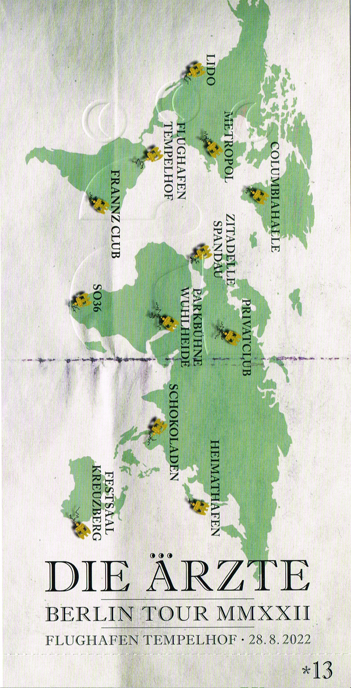

import { LinkCard, Card, CardGrid } from '@astrojs/starlight/components';
import { Image } from 'astro:assets';

import img2013 from '../../../gallery/2022/08/28/2022-08-28_20-13-13.jpg';
import img2108 from '../../../gallery/2022/08/28/2022-08-28_21-08-30.jpg';
import img2150 from '../../../gallery/2022/08/28/2022-08-28_21-50-08.jpg';
import img2200 from '../../../gallery/2022/08/28/2022-08-28_22-00-07.jpg';

## 🎫 Ticket

## 📌 Details
📅 Datum: 28.08.2022  
🇩🇪 Land: Deutschland  
📍 Stadt: Berlin  
🏟️ Venue: Flughafen Tempelhof  
💶 Preis: 72,00 €  

## 📷 Fotos

<CardGrid>
  <Card title="20:13" icon="image">
    <Image src={img2013} alt="die ärzte um 20:13" widths={[300, 600, 900]} sizes="(max-width: 600px) 100vw, 600px" />
  </Card>
  <Card title="21:08" icon="image">
    <Image src={img2108} alt="die ärzte um 21:08" widths={[300, 600, 900]} sizes="(max-width: 600px) 100vw, 600px" />
  </Card>
  <Card title="21:50" icon="image">
    <Image src={img2150} alt="die ärzte um 21:50" widths={[300, 600, 900]} sizes="(max-width: 600px) 100vw, 600px" />
  </Card>
  <Card title="22:00" icon="image">
    <Image src={img2200} alt="die ärzte um 22:00" widths={[300, 600, 900]} sizes="(max-width: 600px) 100vw, 600px" />
  </Card>
</CardGrid>

## 🎤 Konzertbericht

Am 28. August 2022 war ich im Rahmen der "Berlin Tour MMXXII" von die ärzte im Flughafen Tempelhof in Berlin.

## 💿 Alben

<CardGrid>

    <Card title="Hell" icon="seti:audio">
        
    </Card>
    <Card title="Dunkel" icon="seti:audio">
        
    </Card>
</CardGrid>

## 🎶 Setlist

<Card title="Songs" icon="list-format">
01. Gute Nacht
02. Himmelblau
03. Noise
04. Ein Lied für Dich
05. Meine Freunde
06. Blumen
07. Hurra
08. Fiasko
09. Angeber
10. Ist das noch Punkrock?
11. Doof
12. Heulerei
13. Lasse redn
14. Madonnas Dickdarm
15. Besserwisserboy
16. Punkbabies
17. Schunder-Song
18. Ich, am Strand
19. Lady
20. 1/2 Lovesong
21. Morgens Pauken
22. Friedenspanzer
23. Der Graf
24. Kraft
25. Kamelralley
26. Zitroneneis
27. Erna P.
28. Deine Schuld
29. Perfekt
30. Unrockbar
31. Dinge von denen
32. Sommer, Palmen, Sonnenschein
33. Ignorama
34. Wie es geht
35. Mach die Augen zu
36. Dunkel
37. Wir sind die Besten
38. Schrei nach Liebe
39. Junge
40. Zu spät
41. Dauerwelle vs. Minipli
42. Gute Nacht
</Card>

<LinkCard
    title="Mehr Informationen"
    href="https://fanieng.com/2022/08/28/die-aerzte-berlin-flughafen-tempelhof/"
/>
