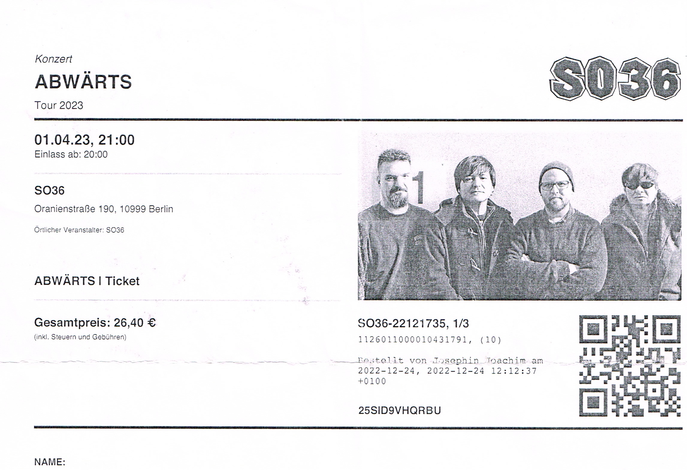

import { LinkCard, Card, CardGrid } from '@astrojs/starlight/components';
import { Image } from 'astro:assets';

import img2150 from '../../../gallery/2023/04/01/2023-04-01_21-50-15.jpg';
import img2215 from '../../../gallery/2023/04/01/2023-04-01_22-15-00.jpg';
import img2316 from '../../../gallery/2023/04/01/2023-04-01_23-16-16.jpg';
import img2320 from '../../../gallery/2023/04/01/2023-04-01_23-20-53.jpg';

## 🎫 Ticket

## 📌 Details
📅 Datum: 01.04.2023  
🇩🇪 Land: Deutschland  
📍 Stadt: Berlin  
🏟️ Venue: SO 36  
💶 Preis: 26,40 €  

## 📷 Fotos

<CardGrid>
  <Card title="21:50" icon="image">
    <Image src={img2150} alt="Abwärts um 21:50" widths={[300, 600, 900]} sizes="(max-width: 600px) 100vw, 600px" />
  </Card>
  <Card title="22:15" icon="image">
    <Image src={img2215} alt="Abwärts um 22:15" widths={[300, 600, 900]} sizes="(max-width: 600px) 100vw, 600px" />
  </Card>
  <Card title="23:16" icon="image">
    <Image src={img2316} alt="Abwärts um 23:16" widths={[300, 600, 900]} sizes="(max-width: 600px) 100vw, 600px" />
  </Card>
  <Card title="23:20" icon="image">
    <Image src={img2320} alt="Abwärts um 23:20" widths={[300, 600, 900]} sizes="(max-width: 600px) 100vw, 600px" />
  </Card>
</CardGrid>

## 🎤 Konzertbericht

Am 01.04.2023 trat die Band Abwärts im SO 36 in Berlin auf.   
Es war wohl mein letztes Konzert mit dieser Band, da der Sänger Frank Z. im Mai 2023 verstarb.   
Das Konzert war Teil ihrer Tour 2023 und fand in der legendären Location SO 36 statt, 
die für ihre Punk- und Rockkonzerte bekannt ist.  

## ❤️ Fazit

Als langjähriger Fan von die ärzte war es eine besonderes Erlebnis für mich, 
Rodorigo González, den Bassisten in kleinerem Rahmen und der Clubatmosphäre zu sehen.

<Card title="Album" icon="seti:audio">
  
</Card>

<Card title="Setlist" icon="list-format">
01. Beim ersten Mal tut's immer weh
02. Smart Bomb
03. Autonomes Fahren
04. Schiffe
05. Europa Safe
06. Wachkoma
07. Sonderzug
08. Alkohol
09. Propaganda ist
10. Going Down
11. Superfucker
12. Allein unter Flaschen
13. Berlin und Hopsasa
14. Unfall
15. Alabama Song (Whisky Bar)
16. Berlin Görlitzer Park
17. Was die Welt jetzt braucht
18. Die Zeit
19. Sehnsucht
20. Zonenzombie
21. Millionen Killer
22. Hauptsache Baby
23. Terror-Beat
24. Computerstaat
</Card>

<LinkCard
    title="Mehr Informationen"
    href="https://fanieng.com/2023/04/01/abwaerts-berlin-so-36/"
/>
