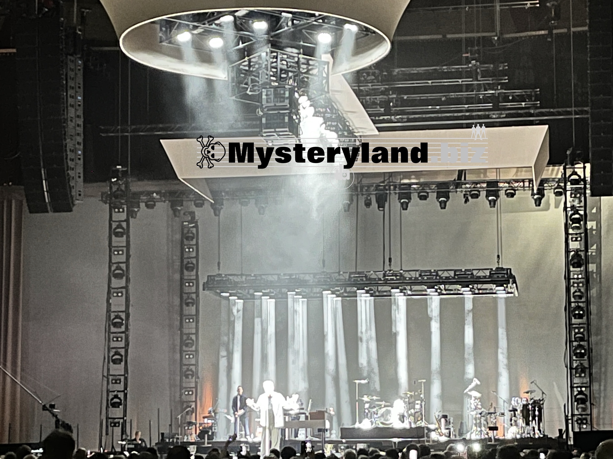
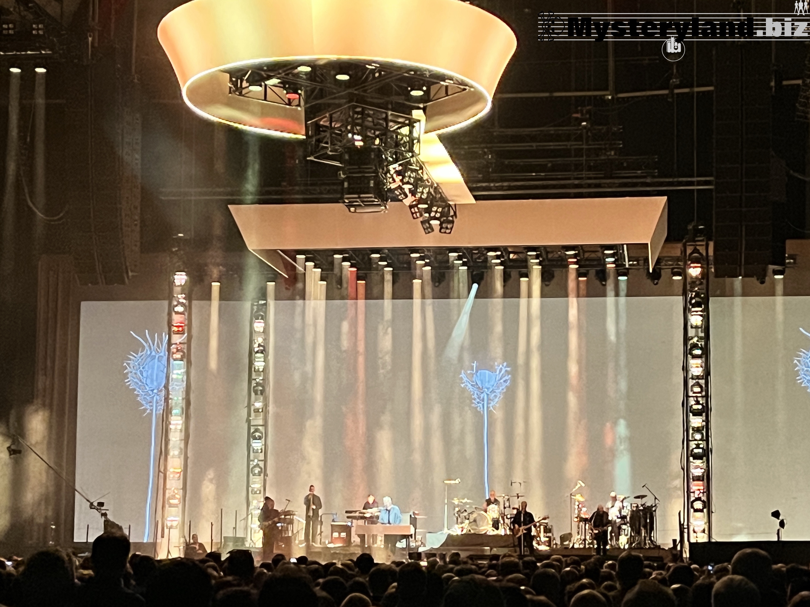

import { LinkCard, Card, CardGrid } from '@astrojs/starlight/components';

## 🎫 Ticket

## 📌 Details
📅 Datum: 19.05.2023  
🇩🇪 Land: Deutschland  
📍 Stadt: Dortmund
🏟️ Venue: Westfalenhalle    
💶 Preis: 74,85 €  

<CardGrid>
  <Card title="20:47" icon="image">
    
  </Card>
  <Card title="20:51" icon="image">
    
  </Card>
</CardGrid>

## 🎤 Konzertbericht

Am 19. Mai 2023 war ich im Rahmen der Tour "Das ist los" von Herbert Grönemeyer in der Westfalenhalle in Dortmund. 
Es war ein unvergesslicher Abend voller Emotionen und mitreißender Musik.

Grönemeyer, der seit Jahrzehnten zu den größten Stars der deutschen Musikszene zählt, präsentierte ein beeindruckendes Konzert, 
das die Fans in seinen Bann zog. Mit seiner unverwechselbaren Stimme und einer energiegeladenen Performance begeisterte er das Publikum von Anfang bis Ende.

## ❤️ Fazit

Die Atmosphäre in der Westfalenhalle war elektrisierend, und Grönemeyer verstand es, die Emotionen des Publikums zu wecken.

<Card title="Album" icon="seti:audio">
  
</Card>

<Card title="Setlist" icon="list-format">
01. Tau
02. Das ist los
03. Bist du da
04. Sekundenglück
05. Kopf hoch, tanzen
06. Steigerlied
07. Bochum
08. Männer
09. Was soll das
10. Vollmond
11. Eine Tonne Blei
12. Der Schlüssel
13. Doppelherz /  Iki Gönlüm
14. Musik nur, wenn sie laut ist
15. Oh Oh Oh
16. Herzhaft
17. Der Weg
18. Behutsam
19. Deine Hand
20. Mensch
21. Alkohol
22. Angstfrei
23. Bleibt alles anders
24. Turmhoch
25. Flugzeuge im Bauch
26. Zeit, dass sich was dreht
27. Urverlust
28. Halt mich
29. Demo (Letzter Tag)
30. Currywurst
31. Mein Lebensstrahlen
32. Land unter
33. Mambo
34. Immerfort
</Card>

<LinkCard
    title="Mehr Informationen"
    href="https://fanieng.com/2023/05/19/2023-05-2019-herbert-gronemeyer-dortmund-westfalenhalle/"
/>

