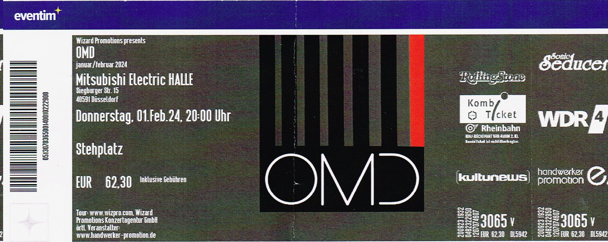

import { Card } from '@astrojs/starlight/components';
import { LinkCard } from '@astrojs/starlight/components';

## Ticket

## Details
📅 Datum: 01.02.2024  
🇩🇪 Land: Deutschland  
📍 Stadt: Düsseldorf
🏟️ Venue: Mitsubishi Electric HALLE  
💶 Preis: 62,30 €  

## Konzertbericht

Am 01. Februar 2024 fand in der Mitsubishi Electric HALLE in Düsseldorf ein Konzert von OMD (Orchestral Manoeuvres in the Dark) statt. 
Die Band, die für ihren einzigartigen Synthie-Pop-Sound bekannt ist, begeisterte das Publikum mit einer Mischung aus Klassikern und neuen Hits.

<Card title="Setlist" icon="list-format">
- Evolution of Species 
- Anthropocene
- Messages
- Tesla Girls
- Kleptocracy
- History of Modern (Part I)
- If You Leave
- (Forever) Live and Die
- Bauhaus Staircase
- Souvenir
- Joan of Arc
- Joan of Arc (Maid of Orleans)
- The Rock Drill
- Veruschka
- Healing
- Don't Go
- So in Love
- Dreaming
- Locomotion
- Sailing on the Seven Seas
- Enola Gay
- Look at You Now
- Pandora's Box
- Electricity
</Card>

<LinkCard
    title="Mehr Informationen"
    href="https://fanieng.com/2024/02/01/2024-02-01-omd-duesseldorf-mitsubishi-electric-halle/"
/>
