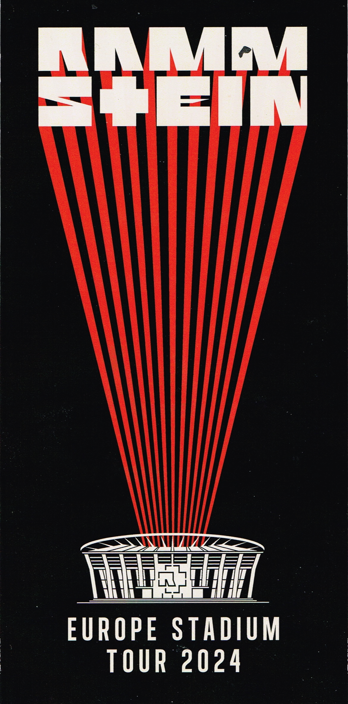

import { Card } from '@astrojs/starlight/components';
import { LinkCard } from '@astrojs/starlight/components';

## Ticket

## Details
📅 Datum: 26.07.2024
🇩🇪 Land: Deutschland  
📍 Stadt: Gelsenkirchen  
🏟️ Venue: VELTINS-Arena  
💶 Preis: 117,58 €  

<Card title="Album" icon="seti:audio">
  
</Card>

<Card title="Setlist" icon="list-format">

01. Music for the Royal Fireworks  
02. Ramm 4  
03. Links 2 3 4  
04. Keine Lust  
05. Sehnsucht  
06. Asche zu Asche  
07. Mein Herz brennt  
08. Puppe  
09. Wiener Blut  
10. Zeit  
11. Deutschland (Remix by Richard Z. Kruspe) 
12. Deutschland  
13. Radio  
14. Mein Teil  
15. Du hast  
16. Sonne  
17. Engel  
18. Ausländer  
19. Du riechst so gut  
20. Pussy  
21. Ich will  
22. Rammstein  
23. Adieu  

</Card>

<LinkCard
    title="Mehr Informationen"
    href="https://fanieng.com/2024/07/26/26-07-2024-rammstein-gelsenkirchen-veltins-arena/"
/>