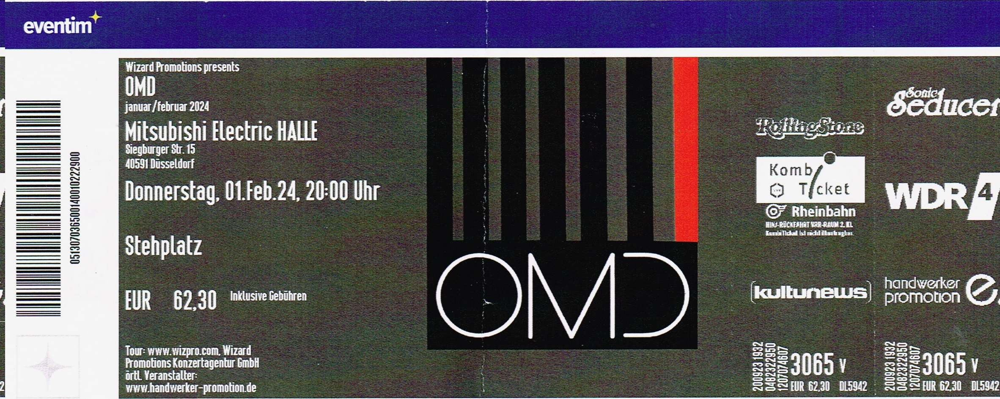

import { Card } from '@astrojs/starlight/components';
import { LinkCard } from '@astrojs/starlight/components';

## Ticket

## 🎤 Konzertbericht

Am 12.10.204 durfte ich ein mitreißendes Live-Konzert von Nena erleben.
Zwischen Nostalgie, Überraschungen und einer starken Bühnenpräsenz blieb kein Wunsch offen.

## ❤️ Fazit

Nena beweist auch heute noch, wie kraftvoll und relevant ihre Musik ist.

Besonders bewegend: ihr empathischer Umgang mit dem Publikum – und natürlich die zeitlosen Gänsehaut-Momente
bei **Irgendwie, Irgendwo, Irgendwan** und **„99 Luftballons“.**

<Card title="Setlist" icon="list-format">
- Liebe ist
- Nur geträumt
- Willst du mit mir gehn
- Licht
- ? (Fragezeichen)
- Karawane
- Noch einmal
- Zaubertrick
- Rette mich
- Wir kommen in Frieden
- In meinem Leben
- Wunder gescheh'n
- Genau jetzt
- Oldschool #1
- Vollmond
- Oldschool #2
- PI ich rechne mit allem
- Es regnet
- Leuchtturm / Blitzkrieg Bop
- 99 Luftballons / Hey Jude
- Irgendwie, irgendwo, irgendwann
- Zusammen
- Alles neu
</Card>

<LinkCard
    title="Mehr Informationen"
    href="https://fanieng.com/2024/10/12/12-10-2024-nena-bochum-ruhrcongress/"
/>