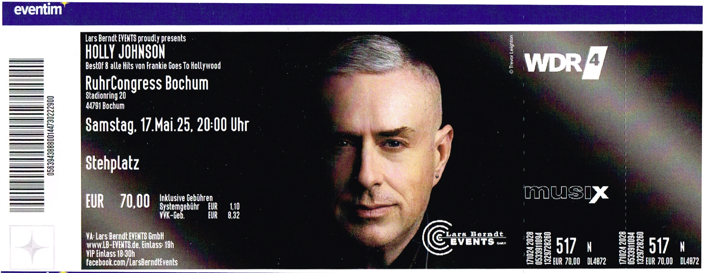

---

title: "Holly Johnson@Bochum/RuhrCongress"

description: "Eventbericht über das Konzert von Holly Johnson im RuhrCongress Bochum am 17.05.2025."

pubDate: 2025-05-17

featuredImage: "/src/content/gallery/2025/05-17/2025-05-17_20-00-00.jpg"

venue: "RuhrCongress"

city: "Bochum"

price: 70.00

artist: ["Holly Johnson"]

tags: ["Ticket","Bochum","Deutschland","Konzert","2025","RuhrCongress","Holly Johnson"]
---
import { Card } from '@astrojs/starlight/components';
import { LinkCard } from '@astrojs/starlight/components';

## Ticket

## Konzertbericht

Am 17. Mai 2025 trat Holly Johnson im RuhrCongress Bochum auf. Der Abend war ein unvergessliches Erlebnis, das die Fans in eine musikalische Reise entführte. 
Mit einer Mischung aus Klassikern und neuen Hits begeisterte Johnson das Publikum und sorgte für eine ausgelassene Stimmung.

<Card title="Setlist" icon="list-format">

- Welcome to the Pleasuredome
- Black Night White Light
- Rage Hard
- Happy Hi!
- Wish (the Lads Were Here)
- Americanos
- Atomic City
- Heaven's Here
- Love Train
- Penny Arcade
- Watching the Wildlife
- Born to Run
- War
- Two Tribes
- Relax
- The Power of Love
</Card>

<LinkCard
    title="Mehr Informationen"
    href="https://fanieng.com/2025/05-17/2025-05-17-holly-johnson-bochum-ruhrcongress/"
/>
