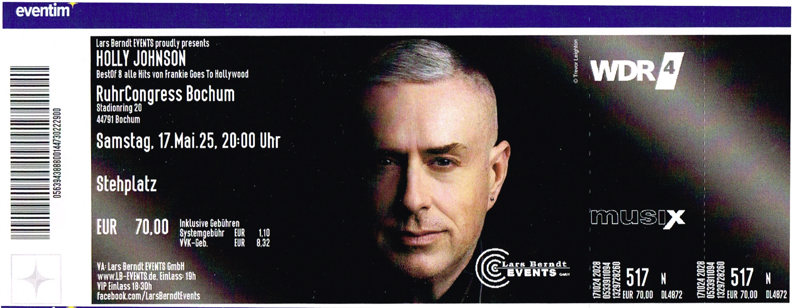

---

title: "Holly Johnson"

description: "Eventbericht über das Konzert von Holly Johnson im RuhrCongress Bochum am 17.05.2025."

tour: "Holly Johnson"

artist: ["Holly Johnson"]

pubDate: 2025-05-17

venue: "RuhrCongress"

city: "Bochum"

price: 70.00

asin: "B08GG2RKD4"

tags: ["Ticket","Bochum","Deutschland","Konzert","2025","RuhrCongress","Holly Johnson"]
---
import { Card } from '@astrojs/starlight/components';
import { LinkCard } from '@astrojs/starlight/components';

## Ticket

## Details

📅 Datum: 17.05.2025  
🇩🇪 Land: Deutschland  
📍 Stadt: Bochum        
🏟️ Venue: RuhrCongress  
💶 Preis: 70,00 €

## Konzertbericht

- Am 17. Mai 2025 konnte ich Holly Johnson im RuhrCongress Bochum nach meinen früheren Erfahrungen mit Playback-Auftritten u.a. bei Peter's zum ersten mal **live** erleben.
- Der ehemalige Frontmann von Frankie Goes to Hollywood präsentierte insbesondere mit der Präsenz seiner Live-Stimme ein mitreißendes Konzert, das die Fans begeisterte.   
- Der Abend war ein unvergessliches Erlebnis, das die Fans in eine musikalische Reise entführte.   
- Mit einer Mischung aus Klassikern und neuen Hits begeisterte Johnson das Publikum und sorgte für eine ausgelassene Stimmung.

<Card title="Album" icon="seti:audio">
  
</Card>

<Card title="Setlist" icon="list-format">
01. Welcome to the Pleasuredome  
02. Black Night White Light  
03. Rage Hard  
04. Happy Hi!  
05. Wish (the Lads Were Here)  
06. Americanos  
07. Atomic City  
08. Heaven's Here  
09. Love Train  
10. Penny Arcade  
11. Watching the Wildlife  
12. Born to Run  
13. War  
14. Two Tribes  
15. Relax  
16. The Power of Love  
</Card>

<LinkCard
    title="Mehr Informationen"
    href="https://fanieng.com/2025/05/17/holly-johnson-bochum-ruhrcongress/"
/>
