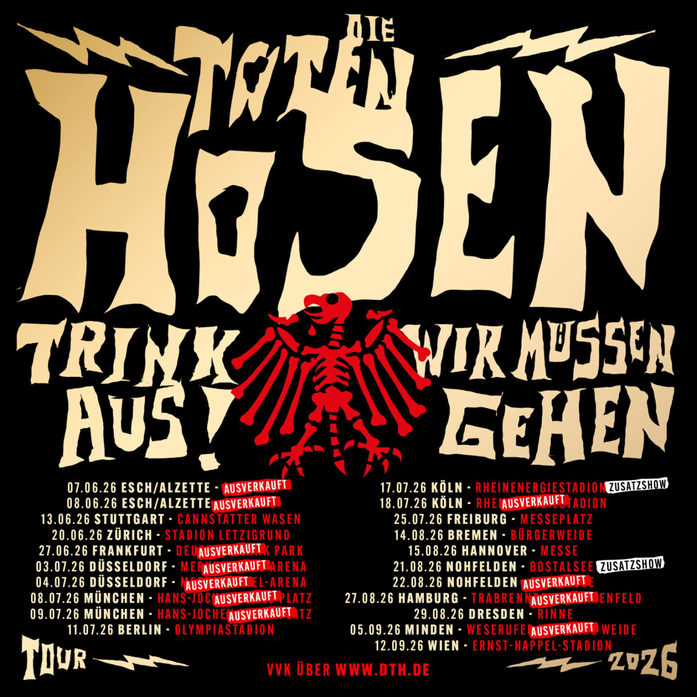

import { Card } from '@astrojs/starlight/components';
import { LinkCard } from '@astrojs/starlight/components';

## Trink Aus! Wir Müssen Gehen - Tour 2026

Nach drei Jahren Pause gehen Die Toten Hosen wieder auf eine große Tournee!

Im fünften Jahrzehnt nach ihrer Gründung verspüren die Hosen eine Lust und einen Hunger auf Konzerte wie selten zuvor. 
Vielleicht liegt das auch an ihrer Lebenssituation: Sie wissen, dass sie mit ihrer Karriere auf der Zielgeraden sind und solche Reisen irgendwann auch ein Ende haben. 
Deshalb wollen sie noch einmal mit alten und neuen Liedern losziehen und jeden Abend so spielen, als wäre es ihr letzter!

## Ticket / Venue / Preis

📅 Datum: 17.07.2026  
🇩🇪 Land: Deutschland  
📍 Stadt: Köln        
🏟️ Venue: RheinEnergieStadion  
💶 Preis: 89,00 €

## Bilder

## Konzertbericht

<Card title="Setlist" icon="list-format">
</Card>

<LinkCard
    title="Mehr Informationen"
    href="https://fanieng.com/2026/07-17/2026-07-17-die-toten-hosen-koeln-rheinergiestadion"
/>

